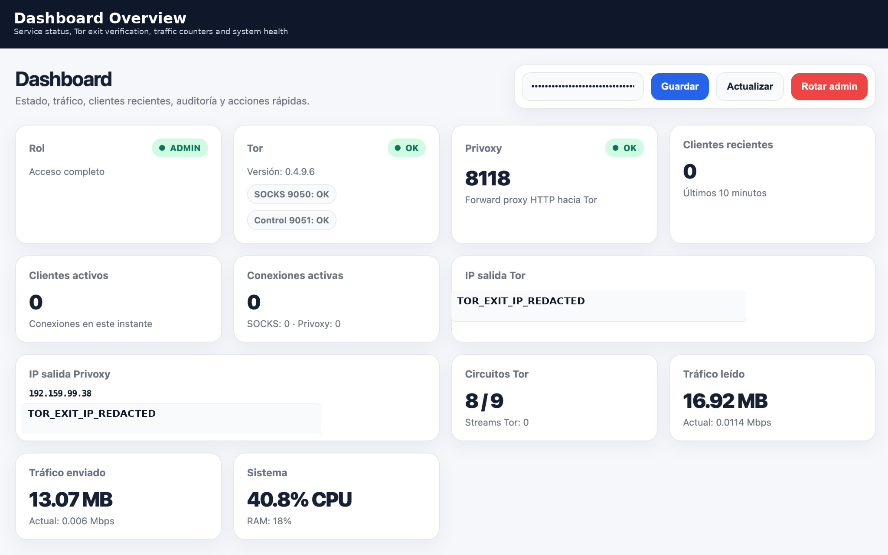

# ProxyTor Gateway

**ProxyTor Gateway** is a self-hosted Tor and Privoxy proxy gateway with a web dashboard, Telegram integration, token-based access control, traffic visibility, audit export, abuse detection and client ban management.

It is designed for homelabs, private security labs, controlled environments and self-hosted infrastructure where a managed Tor/HTTP proxy gateway is required.

**Status:** v0.1.0 — Initial public release.  
Review and adapt the configuration before using it in production.

---

## Dashboard Preview

<p align="center">
  <a href="docs/SCREENSHOTS.md">
    
  </a>
</p>

<p align="center">
  <a href="docs/SCREENSHOTS.md"><strong>View full dashboard screenshot gallery →</strong></a>
</p>

ProxyTor Gateway includes a web dashboard for monitoring Tor, Privoxy, active clients, traffic, audit events, bans and operational actions from a single interface.

---

## Important: NPMplus is optional

ProxyTor Gateway does **not** require NPMplus, Nginx Proxy Manager or any reverse proxy.

It works standalone with direct LAN/VPN access:

| Service | Endpoint |
|---|---|
| Dashboard/API | `http://PROXYTOR_IP:8088/` |
| Privoxy HTTP proxy | `http://PROXYTOR_IP:8118` |
| Tor SOCKS5 proxy | `PROXYTOR_IP:9050` |

A reverse proxy is optional and only needed if you want to expose the dashboard/API over HTTPS using your own domain.

Do **not** expose `9050/tcp` or `8118/tcp` directly to the Internet.

---

## Key Features

- Tor SOCKS5 proxy gateway.
- Privoxy HTTP proxy forwarding traffic through Tor.
- FastAPI-based web dashboard and API.
- Admin and viewer access tokens.
- Telegram bot integration.
- Dynamic token rotation.
- Traffic and connection metrics.
- Recent client visibility.
- Audit and event logging.
- CSV/JSON audit export by date range.
- Abuse detection based on connection thresholds.
- Ban/unban controls from dashboard and Telegram.
- SQLite persistence.
- systemd service units.
- Standalone deployment by default.
- Optional reverse proxy friendly deployment.

---

## Architecture

### Proxy Flow

| Source | Path | Destination |
|---|---|---|
| HTTP clients | `:8118` → Privoxy → Tor | Internet |
| SOCKS5 clients | `:9050` → Tor | Internet |
| Operators | Browser → ProxyTor Dashboard | API `:8088` |
| Telegram | Bot → Local API | Status, tokens, bans |

### Main Components

| Component | Default Port | Description |
|---|---:|---|
| Tor SOCKS | `9050/tcp` | SOCKS5 proxy for trusted clients |
| Tor ControlPort | `9051/tcp` | Local-only Tor control interface |
| Privoxy | `8118/tcp` | HTTP proxy forwarding through Tor |
| ProxyTor API | `8088/tcp` | FastAPI dashboard and API |
| SQLite | Local file | Events, clients, traffic samples and bans |
| Telegram Bot | Outbound only | Optional operational interface |

---

## Requirements

Recommended environment:

- Debian 12 Bookworm.
- Python 3.11 or newer.
- systemd.
- Tor.
- Privoxy.
- SQLite.
- iptables.
- Optional: reverse proxy for HTTPS dashboard access.
- Optional: Telegram bot.

---

## Security Notice

Do **not** expose these ports directly to the Internet:

| Port | Service |
|---:|---|
| `9050/tcp` | Tor SOCKS proxy |
| `8118/tcp` | Privoxy HTTP proxy |
| `8088/tcp` | ProxyTor API/dashboard |

Recommended protections:

- Keep proxy ports available only on trusted networks.
- Publish the dashboard only through VPN, private access or a properly protected reverse proxy.
- Use strong admin/viewer tokens.
- Rotate tokens periodically.
- Keep Telegram bot credentials private.
- Never commit real tokens, internal IP addresses, production domains or private configuration.

---

## Repository Layout

| Path | Purpose |
|---|---|
| `config/` | Example configuration files |
| `docs/` | Deployment, API, Telegram, optional reverse proxy and security documentation |
| `proxytor_api/` | FastAPI dashboard/API |
| `telegram_bot/` | Telegram bot integration |
| `systemd/` | systemd unit files |
| `scripts/` | Install, update, backup, restore and token scripts |

Expected structure:

- `README.md`
- `LICENSE`
- `CHANGELOG.md`
- `SECURITY.md`
- `config/config.example.json`
- `config/proxytor-telegram.example`
- `config/torrc.example`
- `config/privoxy.example`
- `docs/DEPLOYMENT.md`
- `docs/SECURITY.md`
- `docs/TELEGRAM.md`
- `docs/NPMPLUS.md`
- `docs/API.md`
- `docs/LXC.md`
- `proxytor_api/app.py`
- `proxytor_api/requirements.txt`
- `telegram_bot/telegram_token_bot.py`
- `systemd/proxytor-api.service`
- `systemd/proxytor-telegram-bot.service`
- `systemd/proxytor-token-rotate.service`
- `systemd/proxytor-token-rotate.timer`
- `scripts/install.sh`
- `scripts/update.sh`
- `scripts/backup.sh`
- `scripts/restore.sh`
- `scripts/rotate-token.sh`

---

## Installation

Clone the repository:

```bash
git clone https://github.com/alvarodgarcia/proxytor-gateway.git
cd proxytor-gateway
```

Run the installer:

```bash
sudo bash scripts/install.sh
```

The installer will:

- Install required packages.
- Create `/opt/proxytor-api`.
- Create `/etc/proxytor-api`.
- Create `/var/lib/proxytor-api`.
- Generate admin and viewer tokens if they do not already exist.
- Install application files and systemd services.
- Start the API service.

### Safer re-run behaviour

The installer is designed to be safe to re-run on an existing installation.

By default it preserves:

- Existing admin and viewer tokens.
- Existing `/etc/proxytor-api/config.json`.
- Existing `/etc/default/proxytor-telegram`.
- Existing `/etc/tor/torrc`.
- Existing `/etc/privoxy/config`.

ProxyTor example configurations are copied separately to:

| File | Purpose |
|---|---|
| `/etc/tor/torrc.proxytor.example` | ProxyTor Tor example configuration |
| `/etc/privoxy/config.proxytor.example` | ProxyTor Privoxy example configuration |

Backups of replaced files are stored under:

```text
/root/proxytor-install-backups/
```

### Installer options

| Option | Purpose |
|---|---|
| `--dry-run` | Show what would be done without changing files or restarting services |
| `--skip-packages` | Skip `apt update` and package installation |
| `--force-config` | Replace existing Tor and Privoxy configuration with ProxyTor examples |
| `--help` | Show installer help |

Examples:

```bash
sudo bash scripts/install.sh --dry-run
sudo bash scripts/install.sh --skip-packages
sudo bash scripts/install.sh --force-config
```

Use `--force-config` only when you explicitly want the installer to replace:

```text
/etc/tor/torrc
/etc/privoxy/config
```

After installation, retrieve the generated tokens:

```bash
sudo cat /etc/proxytor-api/token
sudo cat /etc/proxytor-api/token.viewer
```

Open the dashboard:

```text
http://PROXYTOR_IP:8088/
```

Use the HTTP proxy from trusted clients:

```text
http://PROXYTOR_IP:8118
```

---

## Configuration

Main configuration file:

- `/etc/proxytor-api/config.json`

Recommended default settings:

| Setting | Recommended value | Description |
|---|---|---|
| `alert_exit_ip_change` | `false` | Log Tor exit IP changes without Telegram noise |
| `events_view_limit` | `50` | Default dashboard event view limit |
| `events_max_view_limit` | `500` | Maximum event rows shown in dashboard |
| `events_max_rows` | `5000` | Maximum stored audit events |
| `events_export_enabled` | `true` | Allow CSV/JSON event export |
| `abuse_detection_enabled` | `true` | Enable abuse detection |
| `abuse_connections_per_client` | `25` | Alert threshold per client |
| `telegram_alerts` | `true` | Enable Telegram notifications |
| `npmplus_ips` | `[]` | Optional; only needed if using NPMplus/TCP stream in front of ProxyTor |

Example placeholder values:

| Placeholder | Meaning |
|---|---|
| `PROXYTOR_IP` | ProxyTor server IP |
| `LAN_GATEWAY_IP` | LAN gateway/router IP |
| `REVERSE_PROXY_IP` | Optional reverse proxy IP |
| `REVERSE_PROXY_VIP` | Optional reverse proxy virtual IP |

---

## Telegram Bot

Copy the example configuration:

- `sudo cp config/proxytor-telegram.example /etc/default/proxytor-telegram`
- `sudo nano /etc/default/proxytor-telegram`
- `sudo chmod 600 /etc/default/proxytor-telegram`

Required values:

| Variable | Description |
|---|---|
| `TELEGRAM_BOT_TOKEN` | Telegram bot token |
| `TELEGRAM_CHAT_ID` | Authorized chat ID |
| `PROXYTOR_URL` | Public or internal dashboard URL |

Enable and start the bot:

- `sudo systemctl enable --now proxytor-telegram-bot`

Available commands:

| Command | Purpose |
|---|---|
| `/start` | Show help |
| `/help` | Show help |
| `/token` | Show viewer token |
| `/token_viewer` | Show viewer token |
| `/token_admin` | Show admin token |
| `/rotate_viewer_token` | Rotate viewer token |
| `/rotate_admin_token` | Rotate admin token |
| `/status` | Show service and proxy status |
| `/url` | Show dashboard URL |
| `/bans` | Show active bans |
| `/ban IP 1h` | Ban an IP for 1 hour |
| `/ban IP 24h` | Ban an IP for 24 hours |
| `/ban IP permanent` | Ban an IP permanently |
| `/unban IP` | Remove an active ban |

---

## Optional Reverse Proxy

A reverse proxy is optional and only needed if you want HTTPS/dashboard access through a domain.

Supported examples:

- NPMplus
- Nginx Proxy Manager
- Nginx
- Caddy
- Traefik
- Cloudflare Tunnel
- WireGuard/Tailscale private access

Recommended dashboard publishing model:

| Field | Value |
|---|---|
| Domain | `proxytor.example.com` |
| Scheme | `http` |
| Forward Host/IP | `PROXYTOR_IP` |
| Forward Port | `8088` |
| Websockets | Off |
| Force SSL | On |
| HTTP/2 | On |

Do not expose Tor SOCKS or Privoxy as standard HTTP proxy hosts.

If using TCP streams through a reverse proxy, ProxyTor may only see the reverse proxy IP instead of the real client IP.

---

## Audit and Event Export

ProxyTor stores operational events in SQLite.

The dashboard allows:

- Limiting visible audit events.
- Exporting events by date range.
- Downloading CSV.
- Downloading JSON.

Example API export:

- `curl -H "Authorization: Bearer VIEWER_TOKEN" "http://127.0.0.1:8088/api/events/export?date_from=2026-01-01&date_to=2026-01-31&format=csv" -o proxytor-events.csv`

---

## Abuse Detection and Banning

ProxyTor can detect clients with excessive active connections.

When abuse is detected:

- A warning event is stored.
- Telegram can send an alert.
- The operator can ban the client for 1 hour, 24 hours or permanently.

Ban actions are applied through a dedicated iptables chain:

- `PROXYTOR_BAN`

Only configured proxy ports are affected.

---

## Useful Commands

| Task | Command |
|---|---|
| Check Tor | `systemctl status tor@default --no-pager` |
| Check Privoxy | `systemctl status privoxy --no-pager` |
| Check API | `systemctl status proxytor-api --no-pager` |
| Check Telegram bot | `systemctl status proxytor-telegram-bot --no-pager` |
| Check listening ports | `ss -lntup | grep -E ':9050|:9051|:8118|:8088'` |
| Test Tor SOCKS | `curl --socks5-hostname 127.0.0.1:9050 https://check.torproject.org/api/ip` |
| Test Privoxy | `curl -x http://127.0.0.1:8118 https://check.torproject.org/api/ip` |
| Backup | `sudo bash scripts/backup.sh` |
| Update | `sudo bash scripts/update.sh` |
| Install dry-run | `sudo bash scripts/install.sh --dry-run` |
| Re-run without package install | `sudo bash scripts/install.sh --skip-packages` |
| Force Tor/Privoxy config replacement | `sudo bash scripts/install.sh --force-config` |
| Rotate admin token | `sudo bash scripts/rotate-token.sh` |

---

## Operational Notes

### Viewer vs Admin

| Role | Permissions |
|---|---|
| `viewer` | Read-only dashboard, metrics, events and exports |
| `admin` | Full control, service actions, token rotation and ban management |

Sensitive actions must require the admin token.

### Event Retention

Event storage is limited by configuration to avoid uncontrolled SQLite growth.

Recommended defaults:

| Setting | Value |
|---|---:|
| `events_max_rows` | `5000` |
| `events_view_limit` | `50` |
| `events_max_view_limit` | `500` |

### Tor Exit IP Alerts

Tor exit IP changes can be logged without sending Telegram notifications.

Recommended default:

| Setting | Value |
|---|---|
| `alert_exit_ip_change` | `false` |

---

## Project Status

ProxyTor Gateway is currently in early public release.

Current focus:

- Make deployment repeatable.
- Keep configuration generic.
- Improve documentation.
- Harden operational workflows.
- Avoid committing environment-specific values.

---

## Roadmap

Recently completed:

- More robust installer idempotency.
- Dashboard screenshots.
- GitHub Actions linting.
- Release packaging.
- Better device fingerprinting.
- Docker/LXC examples.

Planned improvements:

- Optional nftables backend.
- Optional allowlist mode.
- Dashboard configuration editor.

---

## Disclaimer

ProxyTor Gateway is intended for legitimate privacy, research, testing and controlled security lab use.

Users are responsible for complying with applicable laws and policies in their jurisdiction and environment.

---

## License

This project is released under the MIT License.
