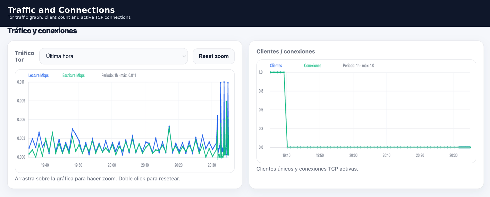
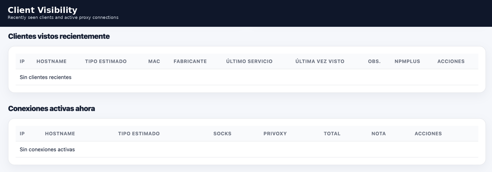
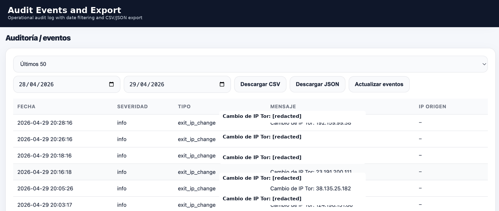
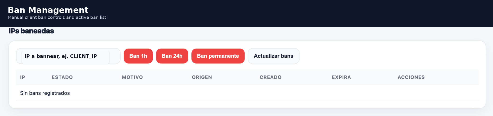
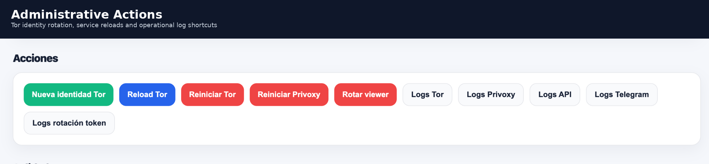
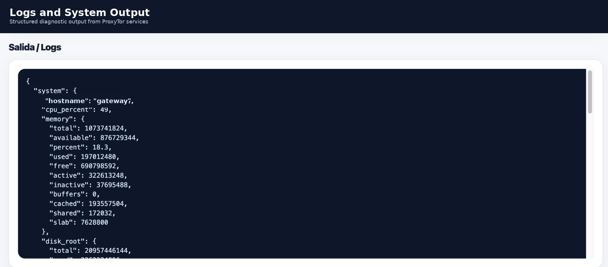
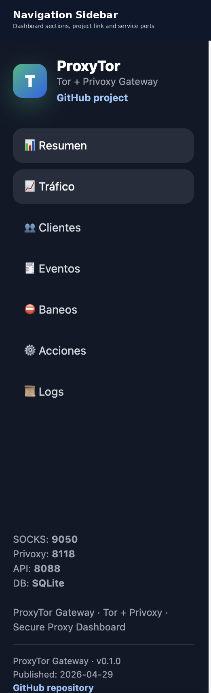

# Screenshots

This page shows sanitized screenshots of ProxyTor Gateway.

Sensitive values such as real IP addresses, hostnames, tokens, private domains and operational logs must be redacted before committing screenshots.

## Dashboard Overview

## Traffic and Connections

## Client Visibility

## Audit Events and Export

## Ban Management

## Administrative Actions

## Logs and System Output

## Navigation Sidebar

---

## Screenshot sanitization checklist

Before publishing screenshots, redact:

- Real public IP addresses.
- Internal LAN IP addresses if they identify your environment.
- Private domains.
- Hostnames.
- Admin/viewer tokens.
- Telegram bot tokens or chat IDs.
- Personal names.
- Operational logs containing sensitive values.
